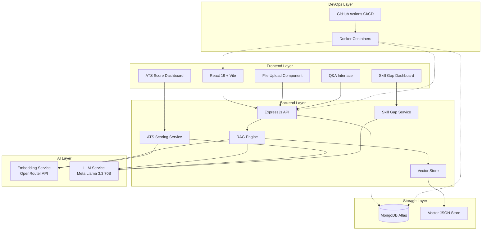

# Product Requirements Document (PRD)
## Smart Resume & JD Analyzer

**Version:** 3.0  
**Date:** May 12, 2026  
**Project Type:** RAG-based Text Intelligence Platform  
**Tech Stack:** MERN + RAG + Docker + CI/CD

---

## 1. Executive Summary

### 1.1 Product Vision
A RAG-powered web application that intelligently analyzes resumes against job descriptions, providing ATS compatibility scores, skill gap analysis, and contextual Q&A insights through natural language queries.

### 1.2 Core Value Proposition
- **Unique Differentiation**: Combines vector-based semantic search with LLM reasoning for contextual resume analysis
- **Real-World Relevance**: Solves actual hiring pain points (candidate screening, skill gap analysis, ATS optimization)
- **Demo-Friendly**: Interactive Q&A interface with instant, explainable results
- **Production-Ready**: Containerized deployment with CI/CD pipeline

### 1.3 Target Audience
- **Primary**: Job seekers optimizing resumes for specific roles
- **Secondary**: Recruiters performing initial candidate screening
- **Tertiary**: Career coaches providing resume feedback

---

## 2. Technical Architecture

### 2.1 System Overview



### 2.2 Technology Stack

#### Frontend
- **Framework**: React 19.2 with Vite 5.4
- **Styling**: TailwindCSS 3.4 with `tailwind-merge` and `clsx` for class management
- **Icons**: Lucide React
- **Animations**: Framer Motion
- **State Management**: React Context API + Hooks (`AuthContext`, `SessionContext`)
- **File Handling**: `react-dropzone` 15.x
- **HTTP Client**: Axios
- **Routing**: React Router DOM 7.x
- **Markdown Rendering**: `react-markdown` for LLM response display

#### Backend
- **Runtime**: Node.js 20+
- **Framework**: Express.js 5.x
- **Database**: MongoDB (Mongoose 9.x ODM) — hosted on MongoDB Atlas
- **File Processing**: 
  - `pdf-parse` for PDF extraction
  - `mammoth` for DOCX parsing
- **File Upload**: Multer 2.x (memory storage, 5MB limit)
- **Authentication**: JWT via `jsonwebtoken` + `bcryptjs` for password hashing
- **Session Management**: In-memory session store (keyed by UUID)

#### RAG Infrastructure
- **Embedding Model**: `openai/text-embedding-3-small` (via OpenRouter)
  - Dimension: 1536
- **LLM**: `meta-llama/llama-3.3-70b-instruct` (via OpenRouter)
- **Vector Store**: Custom JSON-based implementation (`data/vectors.json`) with cosine similarity
- **Chunking Strategy**: Paragraph-based chunking (~500 characters, no overlap)

#### DevOps & Infrastructure
- **Containerization**: Docker + Docker Compose
- **CI/CD**: GitHub Actions (build + Docker image verification)
- **Deployment**: Docker Compose with 3 services (frontend, backend, MongoDB)
- **Environment Management**: dotenv

---

## 3. Core Features & Requirements

### 3.1 Feature: User Authentication

#### User Story
> "As a user, I want to create an account and log in so that my analysis sessions are protected."

#### Implementation Status: ✅ Implemented

#### Details
- **Register**: `POST /api/auth/register` — creates user with `username`, `email`, `password`
- **Login**: `POST /api/auth/login` — returns JWT token (7-day expiry)
- **Password Hashing**: bcrypt with 10 salt rounds
- **Auth Middleware**: JWT verification on all `/api/upload`, `/api/chat`, and `/api/analyze/*` routes
- **Protected Routes**: React `ProtectedRoute` component redirects unauthenticated users

#### Data Model
```javascript
// models/User.js
const userSchema = new mongoose.Schema({
    username: { type: String, required: true, unique: true, trim: true },
    email: { type: String, required: true, unique: true, trim: true, lowercase: true },
    password: { type: String, required: true },
    createdAt: { type: Date, default: Date.now }
});
// Pre-save hook hashes password with bcrypt (10 rounds)
// Instance method: comparePassword(candidatePassword)
```

---

### 3.2 Feature: Document Upload & Processing

#### User Story
> "As a job seeker, I want to upload my resume and a job description so that the system can analyze them contextually."

#### Implementation Status: ✅ Implemented

#### Details
- Single upload endpoint: `POST /api/upload` (multipart form data via Multer)
- Supports PDF (via `pdf-parse`) and DOCX (via `mammoth`)
- File size limit: 5MB
- Text is cleaned (whitespace normalization, paragraph break preservation)
- Each upload generates a UUID doc ID and is added to the vector store
- Files are tracked in an in-memory session store (keyed by session UUID)
- Metadata is persisted to MongoDB when the database connection is available
- Frontend sends `type` field (`resume` or `jd`) to classify the document

#### Data Model
```javascript
// models/Document.js
const documentSchema = new mongoose.Schema({
    sessionId: String,
    filename: String,
    type: { type: String, enum: ['resume', 'jd', 'unknown'] },
    docId: String,       // Reference to vector store entry
    fileSize: Number,
    uploadedAt: { type: Date, default: Date.now }
});
```

#### API
```
POST /api/upload
  Headers: Authorization: Bearer <jwt_token>
  Body: multipart/form-data { file, sessionId?, type }
  Response: { success, sessionId, document: { docId, filename, type, uploadedAt } }
```

---

### 3.3 Feature: RAG-Based Vector Indexing

#### User Story
> "As the system, I need to convert uploaded documents into searchable vector embeddings for semantic retrieval."

#### Implementation Status: ✅ Implemented

#### Details
- On upload, text is chunked into ~500-character segments by paragraph boundaries
- Embeddings generated via OpenRouter API (`openai/text-embedding-3-small`)
- Vectors stored in `server/data/vectors.json` (persisted to disk)
- Each document entry contains: `documentId`, `type`, `chunks[]`, `createdAt`
- Each chunk contains: `id` (UUID), `text`, `embedding` (1536-dim), `metadata`

#### Technical Implementation

**Chunking:**
```javascript
// utils/vectorStore.js — VectorStore.chunkText()
chunkText(text, maxChars = 500) {
    const paragraphs = text.split(/\n\n+/);
    const chunks = [];
    let currentChunk = '';
    for (const para of paragraphs) {
        if ((currentChunk + para).length > maxChars && currentChunk) {
            chunks.push(currentChunk.trim());
            currentChunk = para;
        } else {
            currentChunk += (currentChunk ? '\n\n' : '') + para;
        }
    }
    if (currentChunk) chunks.push(currentChunk.trim());
    return chunks;
}
```

**Embedding Generation:**
```javascript
// utils/vectorStore.js — VectorStore.getEmbeddings()
// Calls OpenRouter: POST https://openrouter.ai/api/v1/embeddings
// Model: openai/text-embedding-3-small
// Batch processes all chunks in a single request
```

**Vector Store Structure (data/vectors.json):**
```json
[
  {
    "documentId": "uuid",
    "type": "resume",
    "chunks": [
      {
        "id": "uuid",
        "text": "Experienced MERN Stack Developer...",
        "embedding": [0.123, -0.456, ...],
        "metadata": { "chunkIndex": 0 }
      }
    ],
    "createdAt": "2026-05-12T12:00:00Z"
  }
]
```

---

### 3.4 Feature: Intelligent Q&A Interface

#### User Story
> "As a user, I want to ask natural language questions about my resume's fit for the job and receive contextual, actionable answers."

#### Implementation Status: ✅ Implemented

#### Details
- Chat endpoint: `POST /api/chat`
- Retrieves top-5 relevant chunks from all session documents using cosine similarity
- Constructs a RAG prompt with retrieved context
- Calls `meta-llama/llama-3.3-70b-instruct` via OpenRouter
- Returns the answer with source citations (chunk text + document type)
- Answers rendered in markdown via `react-markdown` in the chat UI

#### API
```
POST /api/chat
  Headers: Authorization: Bearer <jwt_token>
  Body: { sessionId, question }
  Response: { answer, citations: [{ text, docType, score, ... }] }
```

#### RAG Prompt Template
```
You are an expert career advisor analyzing a resume and job description.
Answer the user's question based ONLY on the provided context.

Context:
[RESUME] chunk text...
[JD] chunk text...

User Question: {question}

Instructions:
- Provide a helpful, constructive answer.
- Cite specific details from the context.
- If information is missing, state that clearly.
```

---

### 3.5 Feature: ATS Score Analysis

#### User Story
> "As a job seeker, I want to see how well my resume would score in an Applicant Tracking System against the target job description."

#### Implementation Status: ✅ Implemented

#### Details
The ATS scoring service evaluates resumes across three weighted dimensions:

| Dimension | Weight | Method |
|-----------|--------|--------|
| **Keyword Match** | 30% | LLM extracts 15-30 keywords from JD → checks presence in resume |
| **Semantic Similarity** | 50% | Cosine similarity of full-text embeddings (normalized from 0.3-0.9 range) |
| **Formatting & Structure** | 20% | Rule-based checks (skills/experience/education sections, bullet points, length) |

- Keyword extraction uses LLM with a fallback to frequency-based heuristics
- Formatting checks: skills section, experience section, education section, bullet points, reasonable length (200-1500 words)
- Summary generated by LLM explaining the score and recommending improvements
- Fallback summaries provided if LLM call fails

#### API
```
POST /api/analyze/score
  Headers: Authorization: Bearer <jwt_token>
  Body: { sessionId }
  Response: {
    score: 0-100,
    breakdown: { keywordMatch: 0-30, semanticSimilarity: 0-50, formatting: 0-20 },
    details: { matchedKeywords, missingKeywords, semanticSimilarity, formattingChecks },
    summary: "string"
  }
```

---

### 3.6 Feature: Skill Gap Analysis

#### User Story
> "As a user, I want a breakdown of which skills I have vs. what the job requires, with actionable improvement suggestions."

#### Implementation Status: ✅ Implemented

#### Details
- Extracts skills from both resume and JD using LLM (with regex-based fallback)
- LLM categorizes each JD skill as: **matched**, **partial** (related skill found), or **missing**
- For missing skills, LLM generates actionable improvement suggestions
- Fallback categorization uses simple substring matching against a curated skills list
- Returns match rate percentage

#### API
```
POST /api/analyze/skills
  Headers: Authorization: Bearer <jwt_token>
  Body: { sessionId }
  Response: {
    matched: ["React", "Node.js"],
    partial: [{ jdSkill: "TypeScript", resumeSkill: "JavaScript" }],
    missing: [{ skill: "Kubernetes", suggestion: "Consider gaining experience..." }],
    meta: { totalJDSkills, totalResumeSkills, matchRate }
  }
```

---

## 4. DevOps Requirements

### 4.1 Containerization with Docker

#### Backend Dockerfile (`server/Dockerfile`)
```dockerfile
FROM node:20-alpine
WORKDIR /app
COPY package*.json ./
RUN npm ci --only=production
COPY . .
RUN mkdir -p data/vectors
EXPOSE 5000
CMD ["node", "server.js"]
```

#### Frontend Dockerfile (`client/Dockerfile`)
```dockerfile
FROM node:20-alpine AS build
WORKDIR /app
COPY package*.json ./
RUN npm ci
COPY . .
RUN npm run build

FROM nginx:alpine
COPY --from=build /app/dist /usr/share/nginx/html
# Inline nginx config for SPA routing
EXPOSE 80
CMD ["nginx", "-g", "daemon off;"]
```

#### Docker Compose (`docker-compose.yml`)
```yaml
version: '3.8'
services:
  mongodb:
    image: mongo:7
    container_name: resume-analyzer-db
    restart: unless-stopped
    ports:
      - "27017:27017"
    volumes:
      - mongo-data:/data/db

  backend:
    build:
      context: ./server
      dockerfile: Dockerfile
    container_name: resume-analyzer-backend
    restart: unless-stopped
    environment:
      PORT: 5000
      MONGO_URI: mongodb://mongodb:27017/resume-analyzer
      OPENROUTER_API_KEY: ${OPENROUTER_API_KEY}
      APP_URL: http://localhost:5000
    ports:
      - "5000:5000"
    depends_on:
      - mongodb
    volumes:
      - ./server/data:/app/data

  frontend:
    build:
      context: ./client
      dockerfile: Dockerfile
    container_name: resume-analyzer-frontend
    restart: unless-stopped
    ports:
      - "80:80"
    depends_on:
      - backend

volumes:
  mongo-data:
```

> **Note:** In local development, the backend runs on port **4000** (per `server/.env`), not 5000. The Docker Compose configuration uses port 5000 for the containerized environment.

---

### 4.2 CI/CD Pipeline with GitHub Actions

#### Current Implementation (`.github/workflows/ci.yml`)
```yaml
name: CI/CD Pipeline

on:
  push:
    branches: [main]
  pull_request:
    branches: [main]

jobs:
  build:
    runs-on: ubuntu-latest
    steps:
    - uses: actions/checkout@v4
    - name: Setup Node.js
      uses: actions/setup-node@v4
      with:
        node-version: '20'
    - name: Install Dependencies (Backend)
      working-directory: ./server
      run: npm ci
    - name: Install Dependencies (Frontend)
      working-directory: ./client
      run: npm ci
    - name: Build Frontend
      working-directory: ./client
      run: npm run build
    - name: Build Backend Docker Image
      run: docker build -t resume-analyzer-backend ./server
    - name: Build Frontend Docker Image
      run: docker build -t resume-analyzer-frontend ./client
```

#### Future Enhancements (Not Yet Implemented)
- [ ] Automated testing on pull requests
- [ ] Push images to container registry (GHCR / Docker Hub)
- [ ] Deploy to staging environment with smoke tests
- [ ] Manual approval for production deployment
- [ ] Rollback capability

---

## 5. Data Models

### 5.1 MongoDB Schemas (Current)

```javascript
// models/User.js
const userSchema = new mongoose.Schema({
    username: { type: String, required: true, unique: true, trim: true },
    email: { type: String, required: true, unique: true, trim: true, lowercase: true },
    password: { type: String, required: true },
    createdAt: { type: Date, default: Date.now }
});

// models/Document.js
const documentSchema = new mongoose.Schema({
    sessionId: String,
    filename: String,
    type: { type: String, enum: ['resume', 'jd', 'unknown'] },
    docId: String,
    fileSize: Number,
    uploadedAt: { type: Date, default: Date.now }
});
```

### 5.2 In-Memory Session Store
```javascript
// controllers/analyzeController.js
// Sessions are stored in-memory (not persisted across server restarts)
const sessions = {
    "session-uuid": {
        files: [
            {
                docId: "doc-uuid",
                filename: "resume.pdf",
                type: "resume",
                text: "extracted text content...",
                uploadedAt: Date
            }
        ]
    }
};
```

> **Note:** Session data (including extracted text) lives only in memory. A server restart clears all active sessions. The MongoDB `Document` model stores metadata only — not the extracted text.

---

## 6. API Endpoints

### 6.1 Authentication
```
POST   /api/auth/register    - Create user (username, email, password) → JWT
POST   /api/auth/login       - Authenticate user (email, password) → JWT
```

### 6.2 Document Upload
```
POST   /api/upload            - Upload resume or JD (multipart, requires auth)
```

### 6.3 RAG Q&A
```
POST   /api/chat              - Ask question about uploaded documents (requires auth)
```

### 6.4 Analysis
```
POST   /api/analyze/score     - Calculate ATS score (requires auth)
POST   /api/analyze/skills    - Analyze skill gaps (requires auth)
```

### 6.5 Health Check
```
GET    /                      - "Resume Analyzer API is running"
```

---

## 7. UI/UX Structure

### 7.1 Page Structure

#### Landing Page (`/`)
- Hero section with value proposition
- Feature highlights (RAG-powered, ATS scoring, skill gap analysis)
- CTA navigates to login

#### Authentication Pages
- **Login** (`/login`) — email + password form
- **Signup** (`/signup`) — username + email + password form

#### Dashboard (`/dashboard/*`) — Protected
Wrapped in `DashboardLayout` with top navigation tabs:

- **Analyzer** (`/dashboard`) — default tab
  - Left sidebar: dual drag-and-drop upload zones (resume + JD)
  - Right area: RAG chat interface (600px height)
  - "How to use" instruction card
- **ATS Score** (`/dashboard/ats-score`)
  - Score card with 0-100 gauge
  - Breakdown: keyword match, semantic similarity, formatting
  - Matched/missing keywords list
  - LLM-generated summary
- **Skill Gap** (`/dashboard/skill-gap`)
  - Matched skills list
  - Partial matches (related skills)
  - Missing skills with actionable suggestions
  - Match rate percentage

### 7.2 Component Inventory
| Component | File | Purpose |
|-----------|------|---------|
| `Navbar` | `Navbar.jsx` | Top navigation bar |
| `Hero` | `Hero.jsx` | Landing page hero section |
| `Features` | `Features.jsx` | Landing page feature highlights |
| `Footer` | `Footer.jsx` | Page footer |
| `Login` | `Auth/Login.jsx` | Login form |
| `Signup` | `Auth/Signup.jsx` | Registration form |
| `ProtectedRoute` | `ProtectedRoute.jsx` | Auth guard for dashboard routes |
| `DashboardLayout` | `DashboardLayout.jsx` | Dashboard shell with tab navigation |
| `FileUpload` | `FileUpload.jsx` | Drag-and-drop upload zone (react-dropzone) |
| `ChatInterface` | `ChatInterface.jsx` | RAG Q&A chat UI with markdown rendering |
| `ATSScoreCard` | `ATSScoreCard.jsx` | ATS score visualization |
| `SkillGapDashboard` | `SkillGapDashboard.jsx` | Skill gap analysis display |

### 7.3 Design System
- **Styling**: TailwindCSS utility classes
- **Color Palette**: 
  - Primary: Indigo/Blue (`blue-500`, `indigo-*`)
  - Background: White + Gray tones
  - Accents: Indigo-50 for info cards
- **Typography**: System defaults via Tailwind
- **Icons**: Lucide React
- **Animations**: Framer Motion for transitions

### 7.4 State Management
- **`AuthContext`** — manages JWT token, user info, login/logout/signup functions
- **`SessionContext`** — manages session ID, uploaded files (resume/JD), upload handlers, readiness state

---

## 8. Environment Variables

### Backend (`server/.env`)
```bash
PORT=4000
OPENROUTER_API_KEY=sk-or-v1-...
MONGO_URI=mongodb+srv://...
APP_URL=http://localhost:4000
```

### Frontend
```bash
# Configured in Vite via vite.config.js or .env
VITE_API_URL=http://localhost:4000  # (if used)
```

---

## 9. Security

### 9.1 Current Implementation
- [x] JWT-based authentication (7-day token expiry)
- [x] Password hashing with bcrypt (10 salt rounds)
- [x] Auth middleware on all API/upload/analyze routes
- [x] File size limits (5MB via Multer)
- [x] CORS enabled (currently open — `cors()` with no origin restrictions)

### 9.2 Not Yet Implemented
- [ ] Refresh tokens
- [ ] Token expiry shortening (currently 7d, should be ~1h for production)
- [ ] Role-based access control (RBAC)
- [ ] CORS restriction to specific origins
- [ ] Rate limiting on API endpoints
- [ ] Input sanitization / injection prevention
- [ ] HTTPS enforcement
- [ ] User data isolation (sessions are not scoped to user IDs)

---

## 10. Performance & Scalability

### 10.1 Current Targets
- [ ] Page load time: < 2 seconds
- [ ] Document processing: < 10 seconds per file
- [ ] Query response time: < 3 seconds
- [ ] Embedding generation: < 5 seconds per document

### 10.2 Known Limitations
- **In-memory sessions**: All session data (including extracted text) is lost on server restart
- **JSON vector store**: Reads/writes entire file on every operation — will not scale past ~100 documents
- **No caching**: Every chat question re-embeds the query
- **Single LLM model**: No fallback if OpenRouter/Llama 3.3 is unavailable

### 10.3 Future Scalability Improvements
- [ ] Migrate vector store to Pinecone/Weaviate for >10K documents
- [ ] Add Redis for session persistence and embedding caching
- [ ] Implement rate limiting (100 requests/hour per user)
- [ ] Add fallback LLM model (e.g., `qwen/qwen-2.5-7b-instruct`)
- [ ] Move file storage to S3/CloudFlare R2 for production

---

## 11. Testing Strategy

### 11.1 Current State
- No automated tests exist yet (`npm test` returns error stub)

### 11.2 Planned
- [ ] Backend: Jest + Supertest (80% coverage target)
  - API endpoint tests
  - Vector store operations
  - Text extraction utilities
- [ ] Frontend: React Testing Library (70% coverage target)
  - Component rendering
  - User interactions
  - State management
- [ ] Integration tests for full upload → analysis flow
- [ ] Manual testing checklist for various file formats

---

## 12. Future Enhancements

### Phase 2 — Near-Term
- [ ] Persist sessions to MongoDB (survive server restarts)
- [ ] Add refresh token flow for secure short-lived JWTs
- [ ] Predefined question templates (e.g., "Am I suitable?", "What skills am I missing?")
- [ ] Confidence scores in Q&A responses
- [ ] Follow-up question support with conversation threading
- [ ] Rate limiting and input sanitization
- [ ] Fallback LLM model

### Phase 3 — Medium-Term
- [ ] Downloadable PDF analysis report
- [ ] Multi-resume comparison against one JD
- [ ] Interview prep question generation based on JD
- [ ] Resume builder with AI-assisted content
- [ ] User data isolation and GDPR-compliant data deletion

### Phase 4 — Long-Term
- [ ] Chrome extension for job board JD analysis
- [ ] LinkedIn profile import as resume
- [ ] Collaborative sharing with mentors/coaches
- [ ] Premium tier with advanced analytics
- [ ] Container registry push + staging/production deployment pipeline

---

## 13. Project Structure

```
resume-analyser/
├── .github/
│   └── workflows/
│       └── ci.yml                  # GitHub Actions CI pipeline
├── client/
│   ├── Dockerfile                  # Multi-stage: Vite build → Nginx
│   ├── src/
│   │   ├── App.jsx                 # Root component with routing
│   │   ├── main.jsx                # Entry point
│   │   ├── components/
│   │   │   ├── Auth/
│   │   │   │   ├── Login.jsx
│   │   │   │   └── Signup.jsx
│   │   │   ├── ATSScoreCard.jsx
│   │   │   ├── ChatInterface.jsx
│   │   │   ├── DashboardLayout.jsx
│   │   │   ├── Features.jsx
│   │   │   ├── FileUpload.jsx
│   │   │   ├── Footer.jsx
│   │   │   ├── Hero.jsx
│   │   │   ├── Navbar.jsx
│   │   │   ├── ProtectedRoute.jsx
│   │   │   └── SkillGapDashboard.jsx
│   │   ├── context/
│   │   │   ├── AuthContext.jsx
│   │   │   └── SessionContext.jsx
│   │   └── pages/
│   │       ├── ATSScorePage.jsx
│   │       ├── LandingPage.jsx
│   │       └── SkillGapPage.jsx
│   ├── tailwind.config.js
│   ├── vite.config.js
│   └── package.json
├── server/
│   ├── Dockerfile
│   ├── server.js                   # Express app entry point
│   ├── .env                        # Environment variables
│   ├── controllers/
│   │   └── analyzeController.js    # Upload + Chat + session management
│   ├── middleware/
│   │   └── authMiddleware.js       # JWT verification
│   ├── models/
│   │   ├── User.js                 # User schema with bcrypt
│   │   └── Document.js             # Document metadata schema
│   ├── routes/
│   │   ├── api.js                  # /api/upload, /api/chat
│   │   ├── auth.js                 # /api/auth/register, /api/auth/login
│   │   └── analyzeRoutes.js        # /api/analyze/score, /api/analyze/skills
│   ├── services/
│   │   ├── atsScoringService.js    # ATS score calculation (3 dimensions)
│   │   └── skillGapService.js      # Skill extraction, matching, suggestions
│   ├── utils/
│   │   ├── textExtractor.js        # PDF/DOCX text extraction
│   │   └── vectorStore.js          # JSON vector store with cosine similarity
│   ├── data/
│   │   └── vectors.json            # Persisted vector embeddings
│   └── package.json
├── docker-compose.yml
├── PRD.md
└── README.md
```

---

## 14. Glossary

- **RAG**: Retrieval-Augmented Generation — AI technique combining vector search with LLM generation
- **Embedding**: Numerical vector representation of text for semantic similarity
- **Vector Store**: Database optimized for storing and searching high-dimensional vectors
- **Cosine Similarity**: Metric for measuring similarity between two vectors (range: -1 to 1)
- **Chunking**: Breaking large text into smaller, semantically meaningful segments
- **LLM**: Large Language Model (e.g., Llama 3.3)
- **ATS**: Applicant Tracking System — software used by recruiters to filter resumes
- **OpenRouter**: API gateway providing access to multiple LLM providers

---

**Document Control:**
- **Author**: Arya Verma
- **Last Updated**: May 12, 2026
- **Version**: 2.0 — Updated to reflect actual codebase state
